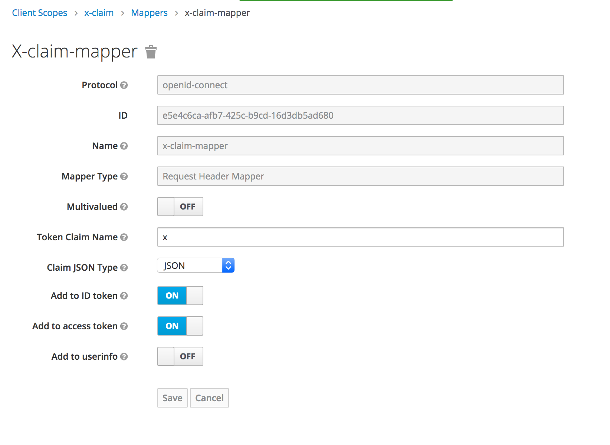

## request-header-oidc-mapper

Map request headers into the Oidc Token

Deploy into folder /opt/jboss/keycloak/standalone/deployments by copying `request-header-oidc-mapper.jar`.



_sample request_

```sh
curl -X POST -v \
  -H "x-some-id: 57a5cb16-1344-470f-8168-24666af9605e" \
  -H "x-tenant-id: 7847c809-c441-4179-b86b-160417961d9e" \
  -d "client_id=my-client" \
  -d "client_secret=d0b8122f-8dfb-46b7-b68a-f5cc4e25d000" \
  -d "grant_type=client_credentials" \
  -d "scope=openid" \
  http://localhost:8080/auth/realms/my/protocol/openid-connect/token
```

_token content_

```js
{
  iss: 'http://localhost:8080/auth/realms/my',
  aud: 'account',
  typ: 'Bearer',
  azp: 'my-client',
  acr: '1',
  clientId: 'my-client',
  x: {
    some_id: '57a5cb16-1344-470f-8168-24666af9605e',
    tenant_id: '7847c809-c441-4179-b86b-160417961d9e'
  },
}
```
